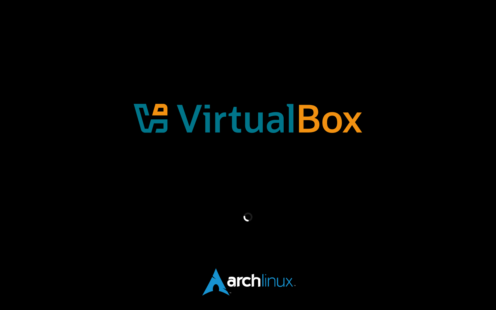

# Animált töltőképernyő (Splash Screen)


> [!IMPORTANT]
> Az útmutatóban szereplő parancsok `root` jogosultságot igényelnek és `mkinitcpio`
> esetén működnek.

## 1. Silent boot
Győződj meg róla, hogy az UEFI-ben engedélyezve van a `Fast Boot` opció, majd módosítsd
a rendszerbetöltőt a következő módon:

### Régi boot entry törlése (amennyiben már telepítve van a rendszer)
1. Listázd ki az eddigi boot opciókat
```bash
efibootmgr
```
2. Töröld ki a jelenleg aktív Arch entry-t (pl.: `0001`)
```bash
efibootmgr -Bb 0001
```

### Új boot entry megadása
Módosítsd az [itt megadott](/Útmutatók/Arch%20Linux/Arch.md#6-rendszerindítás-beállítása)
parancsot a `quiet` és `splash` opciók hozzáadásával.
<pre><code>... -u "root=/dev/sda2 rw <mark>quiet splash</mark> initrd=...</code></pre>

## 2. Kernel HOOK beállítása
Cseréld le az `udev` és `fsck` opciókat `systemd` és `sd-vconsole`-ra.
```bash
sed -i -e '/^HOOKS=/ s/udev/systemd/' -e '/^HOOKS=/ s/fsck/sd-vconsole/' /etc/mkinitcpio.conf
```
[Bővebben...](https://wiki.archlinux.org/title/Silent_boot#fsck)

## 3. Plymouth telepítése
1. Telepítés
```bash
pacman -S plymouth
```
2. Téma alkalmazása
```bash
plymouth-set-default-theme -R bgrt
```

## 4. Újraindítás
Célszerű cold reboot-ot alkalmazni, vagyis kikapcsolni, majd bekapcsolni a számítógépet
hagyományos újraindítás helyett.

## Opcionális
Amennyiben Display Managert használsz (GDM kivételével) és megszűnik az animáció azelőtt,
hogy a bejelentkezési képernyő megjelenne, add hozzá a következő folyamatot a `systemd`-hez:

1. Hozz létre egy `drop-in` fájlt
```bash
systemctl edit display-manager --drop-in=plymouth
```
2. Másold be a következőt:
```properties
[Unit]
Conflicts=plymouth-quit.service
After=plymouth-quit.service rc-local.service plymouth-start.service systemd-user-sessions.service
OnFailure=plymouth-quit.service

[Service]
ExecStartPost=-/usr/bin/sleep 30
ExecStartPost=-/usr/bin/plymouth quit --retain-splash
```
3. Indítsd újra a gépet
